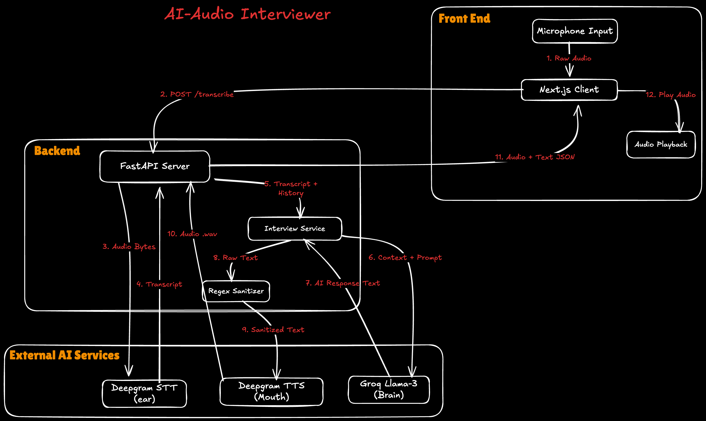

# Bot Interviewer

**Live Demo:** [https://bot-interviewer.vercel.app/](https://bot-interviewer.vercel.app/)

An AI-powered interview preparation platform that helps candidates practice technical and behavioral interviews through real-time audio conversations. The system adapts to different difficulty levels and provides detailed performance feedback after each session.

## Features

### Core Interview System
- Adaptive difficulty levels that progress from easy to medium to hard questions
- Phase-based interview structure covering introduction, technical questions, behavioral questions, and wrap-up
- Real-time audio with click-to-toggle microphone and automatic transcription
- AI interviewer powered by Groq's llama-3.1-8b-instant model
- Professional performance feedback with scoring and improvement suggestions

### User Interface
- Full-screen interview session designed to mimic real video call interviews
- Modern SaaS-style aesthetic with professional color scheme
- Mobile-responsive layout optimized for iOS, Android, and desktop
- Professional alert dialogs for user confirmations
- Smooth animations using Framer Motion

### Audio Pipeline
- Speech-to-text transcription via Deepgram with high accuracy
- Text-to-speech responses for the AI interviewer
- Audio recording using the MediaRecorder API with blob-to-base64 conversion
- Playback functionality with the ability to interrupt the AI

## Getting Started

### Prerequisites
- Python 3.10-3.12
- Node.js 18+
- API Keys: Groq + Deepgram

### Backend Setup

Navigate to the backend directory and create a virtual environment:

```bash
cd backend
python3 -m venv venv
source venv/bin/activate
pip install -r requirements.txt
```

Configure environment variables by copying the example file:

```bash
cp ../.env.example ../.env
```

Edit the `.env` file in the project root and add your API keys for Groq and Deepgram. Then start the server:

```bash
python3 main.py
```

The
```bash
cd frontend
npm install
npm run dev
```

The frontend will run on http://localhost:3000

## Documentation

- **[QUICKSTART.md](QUICKSTART.md)** - Setup and basic usage
- **[IMPLEMENTATION_CHECKLIST.md](IMPLEMENTATION_CHECKLIST.md)** - Complete feature list and testing guide

## Architecture

The application uses a client-server architecture with a React-based frontend and a Python FastAPI backend. Here's how the components work together:



### Frontend (React 18 + Next.js 14)

The frontend provides the user interface and handles all audio interactions:

**Components:**
- `SetupScreen` - User form to collect job description, resume, difficulty level, and session duration
- `InterviewSession` - Full-screen interview interface with video call styling
- `ReportCard` - Displays performance feedback with scores and improvement areas
- `useInterviewAudio` - Custom hook that manages audio recording and playback

**Tech Stack:**
- TypeScript for type safety
- Tailwind CSS for styling
- Framer Motion for smooth animations
- ShadCN UI components (AlertDialog, Button)
- Lucide React Icons for interface icons
- Axios for API communication

### Backend (FastAPI + Python)

The backend processes the interview logic and communicates with external APIs:

**Services:**
- `interview_service.py` - Manages the interview phases, difficulty progression, and validates responses to prevent hallucination
- `audio_service.py` - Handles speech-to-text transcription and text-to-speech for the AI interviewer
- `pdf_service.py` - Parses and extracts information from user-provided resume files

**Tech Stack:**
- FastAPI and Uvicorn for the web server
- Groq API for the AI interviewer
- Deepgram API for audio processing
- Python-multipart for handling file uploads
- Wave module for audio manipulation

## Interview Flow

The interview follows a structured progression with four distinct phases:

1. **Setup Phase** - Users begin by providing:
   - Job description for context
   - Resume (optional) for personalization
   - Difficulty level (Easy, Medium, or Hard)
   - Session duration (5-60 minutes)

2. **Interview Phase** - The interview progresses through four stages:
   - **Introduction** (Messages 1-2): Opening conversation and rapport building
   - **Technical** (Messages 3-5): Skills and knowledge assessment
   - **Behavioral** (Messages 6-8): Soft skills evaluation
   - **Wrap-up** (Messages 9+): Closing questions and remarks

3. **Feedback Phase** - After completing the interview, candidates receive:
   - Performance score on a 1-10 scale
   - Detailed strengths and areas for improvement
   - Option to start a new interview or return to setup

## Smart Features

### Anti-Hallucination System
The system is designed to prevent unrealistic or false information:
- Mandatory citations for technical claims
- No placeholder text or filler responses
- Short interview detection to catch incomplete sessions
- Consistency validation across responses

### Difficulty Adaptation
The question difficulty adjusts based on the selected level:
- **Easy**: Definitions, high-level concepts, foundational knowledge
- **Medium**: Implementation details, real-world scenarios, application knowledge
- **Hard**: System design, optimization strategies, edge cases, advanced topics

### User Experience Enhancements
- Click-to-toggle microphone control (no need to hold down)
- Optional text input as an alternative to voice
- Stop AI button to interrupt ongoing responses
- Full scrollable message history for reference
- Persistent timer in the header

## File Structure

```
.
├── frontend/
│   ├── app/
│   │   ├── page.tsx              # Main controller
│   │   ├── layout.tsx            # Root layout
│   │   └── globals.css           # Tailwind + custom
│   ├── src/
│   │   ├── components/interview/
│   │   │   ├── SetupScreen.tsx
│   │   │   ├── InterviewSession.tsx
│   │   │   └── ReportCard.tsx
│   │   ├── hooks/
│   │   │   └── useInterviewAudio.ts
│   │   └── ui/alert-dialog/      # ShadCN component
│   ├── package.json
│   └── tsconfig.json
│
├── backend/
│   ├── main.py                   # FastAPI application entry point
│   ├── services/
│   │   ├── interview_service.py
│   │   ├── audio_service.py
│   │   └── pdf_service.py
│   ├── requirements.txt
│   └── requirements-dev.txt
│
├── .env                          # Environment configuration
├── README.md                     # This file
├── QUICKSTART.md                 # Setup guide
└── IMPLEMENTATION_CHECKLIST.md   # Feature & testing checklist
```

## 🔌 API Endpoints

| Method | Endpoint | Purpose |
|--------|----------|---------|
## 🔌 API Endpoints

| Method | Endpoint | Purpose |
|--------|----------|---------|
| POST | /transcribe | Convert audio to text |
| POST | /chat | Generate AI interviewer response |
| POST | /feedback | Generate performance score and feedback |

## Browser Support

The application has been tested and works reliably on modern browsers:

- Chrome and Edge version 90 and above
- Safari version 14 and above
- Firefox version 88 and above

Note that microphone access requires either localhost or HTTPS in production environments.

## Mobile Responsiveness


## Deployment

### Frontend Deployment (Vercel/Netlify)

Build the frontend application:

```bash
cd frontend
npm run build
```

The build output can be deployed to platforms like Vercel, Netlify, or any static hosting service.

### Backend Deployment

For production deployment, install a production ASGI server:

```bash
pip install gunicorn
gunicorn -w 4 -k uvicorn.workers.UvicornWorker main:app
```

The backend can be deployed to Railway, Heroku, AWS, or any platform supporting Python applications.

### Environment Configuration

Set the following environment variables in your deployment platform:

**Root .env file:**
- NEXT_PUBLIC_API_URL: Your backend API URL
- FRONTEND_URL: Your frontend domain (for CORS)
- GROQ_API_KEY: Your Groq API key
- DEEPGRAM_API_KEY: Your Deepgram API key

## Troubleshooting

### Backend Server Issues

If the backend fails to start, verify your Python version is between 3.10 and 3.12:

```bash
python3 --version
```

Ensure you're using the virtual environment and reinstall dependencies if needed:

```bash
source venv/bin/activate
pip install -r requirements.txt
```

### Microphone Access Issues

If the microphone isn't working:
- Check browser permissions in Settings > Privacy > Microphone
- Verify you're using localhost or HTTPS (required for production)
- Try opening the application in an incognito or private browsing window

### API Authentication Errors

If you encounter API authentication issues:
- Confirm your API keys are correctly set in the `.env` file
- Test your keys directly on the Groq and Deepgram dashboards
- Check if you've exceeded rate limits on either service

## Future Enhancements

Planned features and improvements for future releases:
- Real-time speech activity detection
- Candidate comparison reports
- Export feedback as PDF
- Analytics dashboard
- Interview history and progress tracking

## Development

The codebase follows standard best practices:
- Type hints in both TypeScript and Python for code clarity
- ESLint configuration for the frontend to maintain code quality
- Modular component architecture for maintainability
- Descriptive naming conventions throughout the project

## Contributing

We welcome contributions to improve the Bot Interviewer. Please feel free to submit pull requests or open issues for bugs and feature suggestions.

## Author

[Zayeem Zaki](https://zayeemzaki.com)
